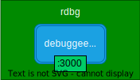
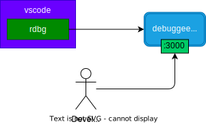
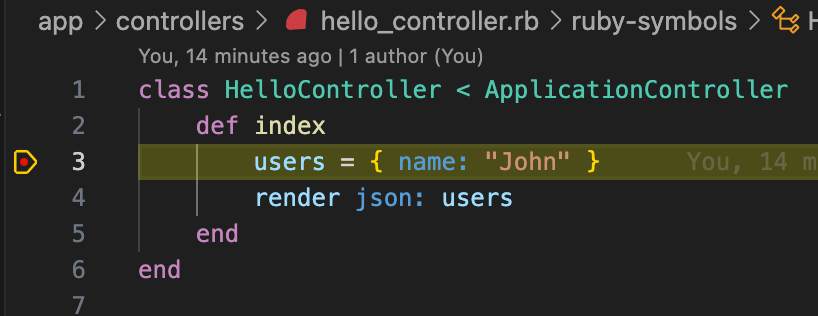
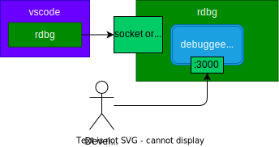
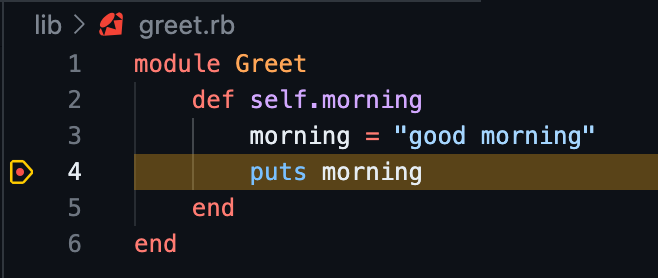
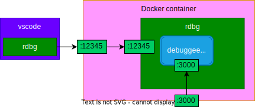

# Debugging Approaches: Understanding Debugging Methods in Different Development Environments

With the evolution of development environments, the utilization of integrated development tools like Visual Studio Code (VSCode) for debugging has gained significant traction. This popularity stems from several advantages over the traditional byebug style.

## Advantages of VSCode Debugging

### Enhanced User Interface and Experience

VSCode offers an intuitive and visually-rich debugging interface that simplifies the debugging process. Its user-friendly design provides a more interactive and streamlined debugging experience compared to the terminal-based byebug.

### No Code Alterations or Clutter in Source Files

Unlike the byebug approach, which often requires inserting debugging statements (e.g., byebug) directly into the source code, debugging with VSCode eliminates the need for such modifications. By utilizing breakpoints and debugger configurations within the VSCode IDE, developers can perform debugging operations without cluttering the source code with debugging artifacts. This helps in maintaining a cleaner and more organized codebase, reducing the risk of introducing errors or messy code due to debugging statements left in the code.

## Disadvantages of VSCode Debugging

Configuring VSCode for debugging across varied environments, like Docker or different operating systems, poses challenges due to:

- Understanding launch.json Configurations: Users need time to grasp and set up the launch.json file, which contains crucial debugging configurations for VSCode.

- Complexities in Docker-Compose Configuration: Configuring docker-compose for attach debugging requires specific setup involving networking, commands and environment variables, demanding additional time and effort.

## Applying Debugging Examples to Your Projects

This README offers diverse debugging scenarios as practical examples that you can directly implement in your projects. These examples provide insights and solutions for troubleshooting across various development environments, serving as valuable references to enhance your debugging practices.

## Types of Debugging

### Launch Debugging

Launch debugging involves running an application and halting execution at specified breakpoints.

Examples of this approach include:

- `byebug`
- `rdbg launch`

### Attach Debugging

Attach debugging involves running an application and attaching a separate debugging program to it through a preferred communication channel.

Example:

- `rdbg attach`

## Networking of Development Environments

Developers often work across various environments like Docker, VSCode, or non-containerized setups. Understanding how debugging programs and debuggees communicate is crucial for effective debugging.

Let's delve into setting up debugging environments for each scenario:

## Preparation

### System Setup

Ensure a consistent development environment by following these steps:

```shell
# Terminal Commands
rbenv install 2.6.8
gem install bundler:2.4.10
bundle install

# VSCode Extension
Install 'VSCode rdbg Ruby Debugger'
```

## Traditional Approach: `byebug` Gem with Rails



To initiate an interactive debugging session within a Rails app using `byebug`:

1. Place `byebug` within your codebase.
2. Run the Rails server:

   ```shell
   bin/rails server
   ```

3. Access the interactive debugging session in the terminal.

   ```shell
   curl localhost:3000/byebug
   ```

   ```ruby
       1: class ByebugController < ApplicationController
       2:     def index
       3:         byebug
    => 4:         data = { name: "byebug" }
       5:         render json: data
       6:     end
       7: end
    (byebug)
   ```

For more information, refer to the [byebug GitHub page](https://github.com/deivid-rodriguez/byebug).

## Debugging with VSCode: Launch and Attach Methods

### Launch Debugging within localhost



1. Set breakpoints in your VSCode.
2. Run the debugee app using VSCode's debugger (`launch local rails`).

   Example:

   ```shell
   curl localhost:3000/hello
   ```

   

### Attach Debugging within localhost



1. Set breakpoints in your VSCode.
2. Start the debuggee program:

   ```shell
   rdbg -n --open -c -- bin/rails console
   ```

3. Use VSCode's debugger to attach (`attach with local rdbg with socket connection`).

Now, you're set to debug and execute sample modules within the VSCode debug session.

```
irb(main):002:0> greet = Greet
=> Greet
irb(main):003:0> greet.morning

good morning
```



## Debugging on Dockerized Applications

### Debugging a Dockerized Rails App



1. Set breakpoints in your VSCode.
2. Run the Docker app:

   ```shell
   docker-compose up
   ```

3. Use VSCode's debugger to attach (`attach on docker port`).

### Debugging on Docker Rails Console

Run the following command for debugging in a Docker Rails console:

```shell
docker-compose run --rm -p 12345:12345 web rdbg -n --open -c -- bin/rails console

# Shortcut
docker-compose run --rm -p 12345:12345 web bin/rails console
```

Use VSCode's debugger to attach (`attach on docker port`).

# References

- [Ruby Debug GitHub](https://github.com/ruby/debug)
- [VSCode Ruby Debugger GitHub](https://github.com/ruby/vscode-rdbg)
